# Alex Little Portfolio
#### GitHub Repo Link: https://github.com/alex1092/portfolio

#### Deployable Site: https://alex1092.github.io/portfolio/ 

## Purpose
This portfolio was devloped as a way to showcase my skills as a developer and to show work I have done.  It contains a contact me form, information about me, my blog page and links to my social media.  

## features and functionality
The design is responsive and accesablble.  It features a fixed navigation bar, css animations and a contact form.

## Sitemap
* I created my portfolio so it would be easy to use.  The navigation bar takes you everywhere you need to go on the website.
* There is also various links to my twitter, linkedin and github on the index.html and contact.html page

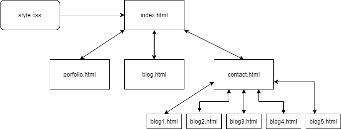

## Wirefram & Design

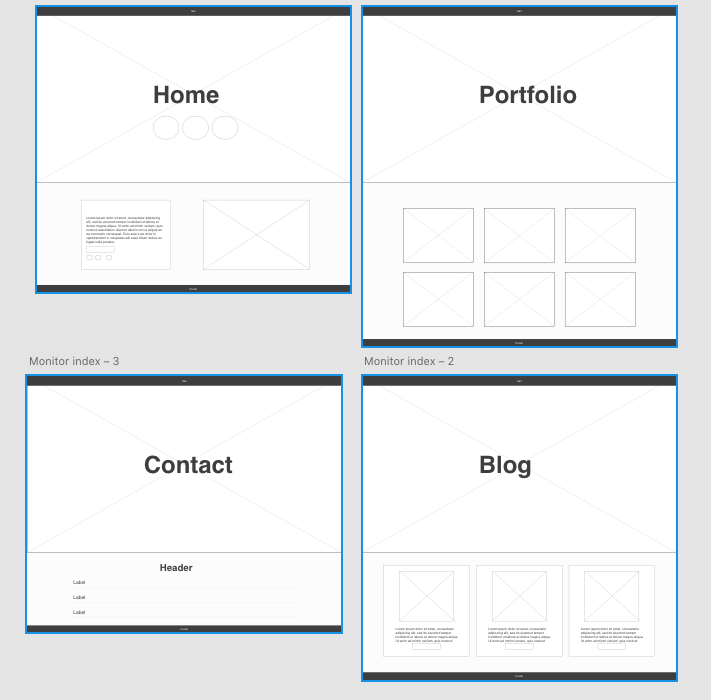
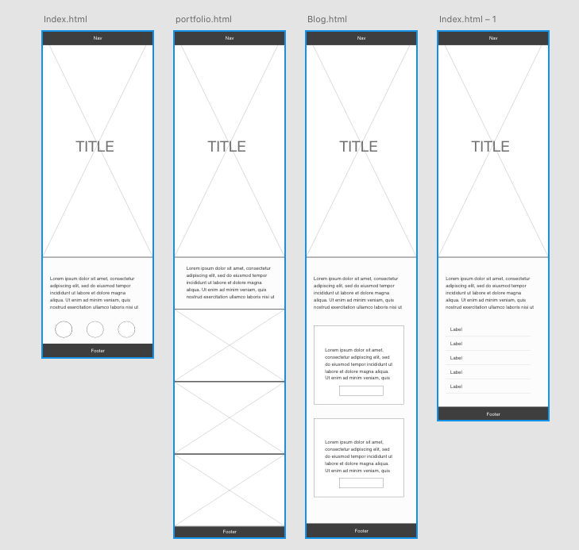

## Screenshots

### Desktop
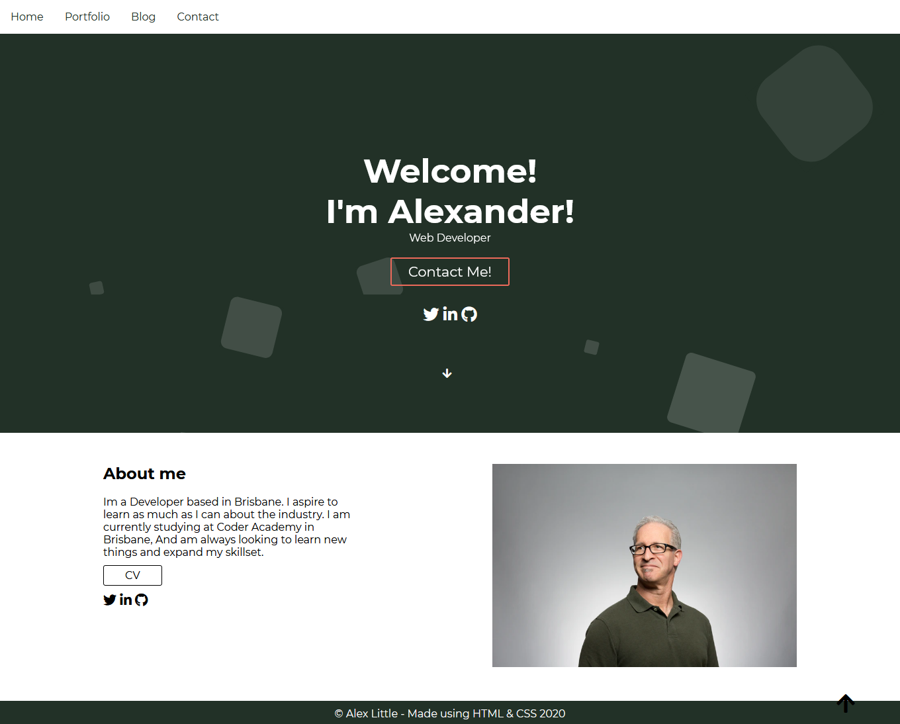
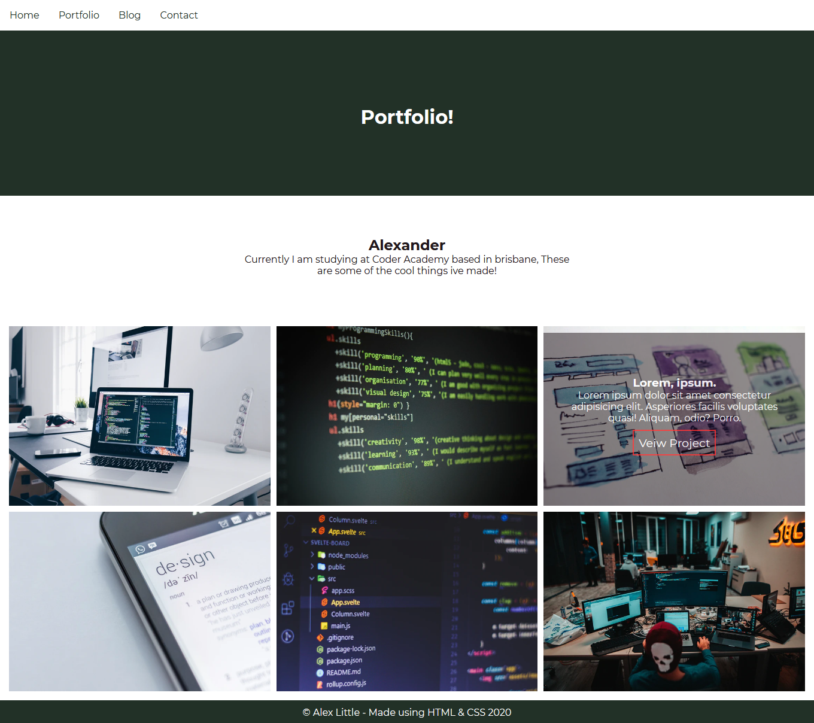
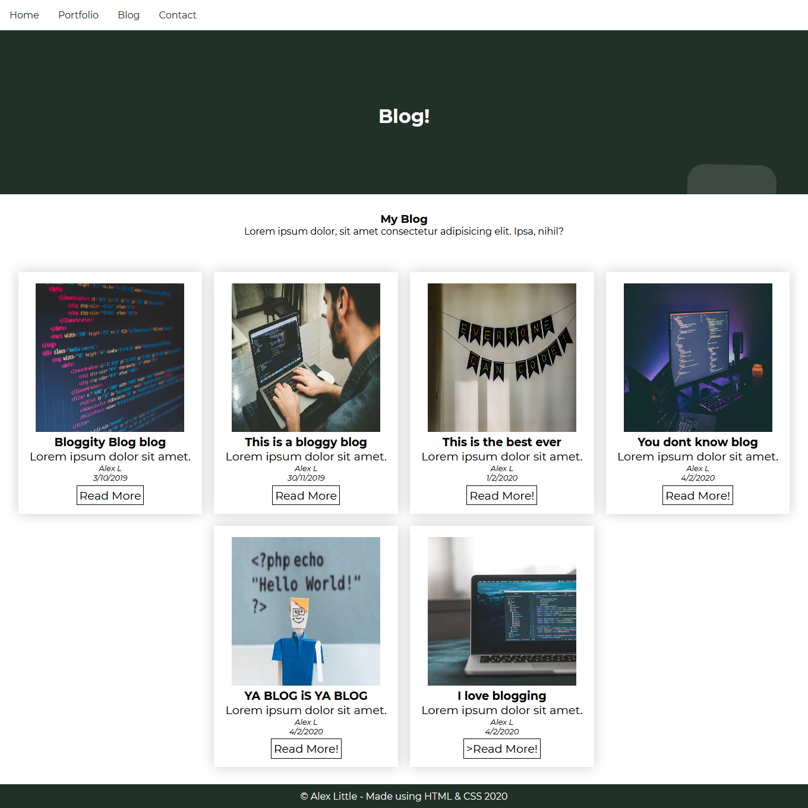
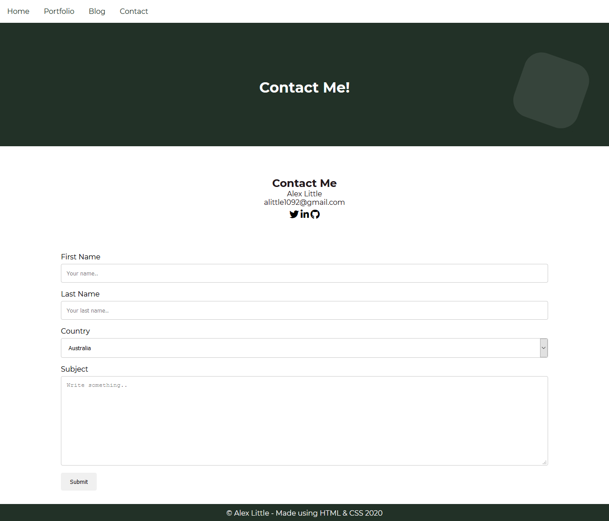

### Mobile
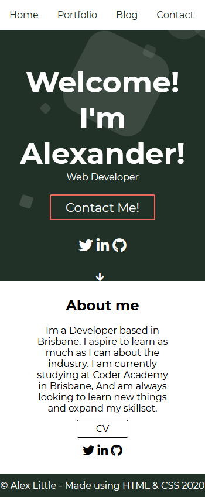

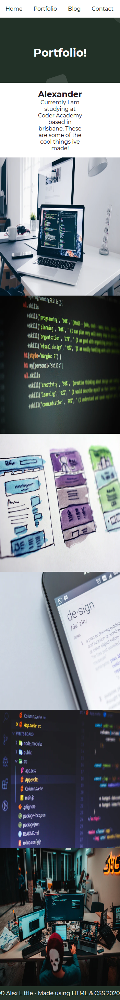

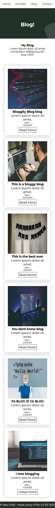

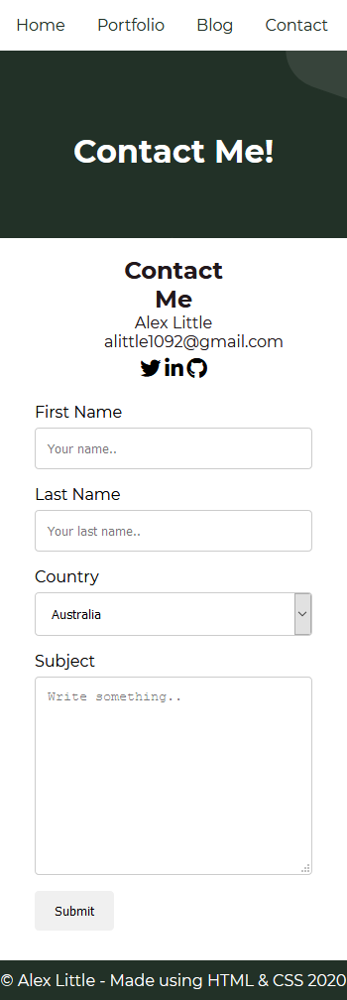

## Target audience

My portfolio was created to show any future employees or for a company who needs a developer

## Tech Stack
* html
* css
* icons imported from font awesome
* Images from http://www.unsplash.com
